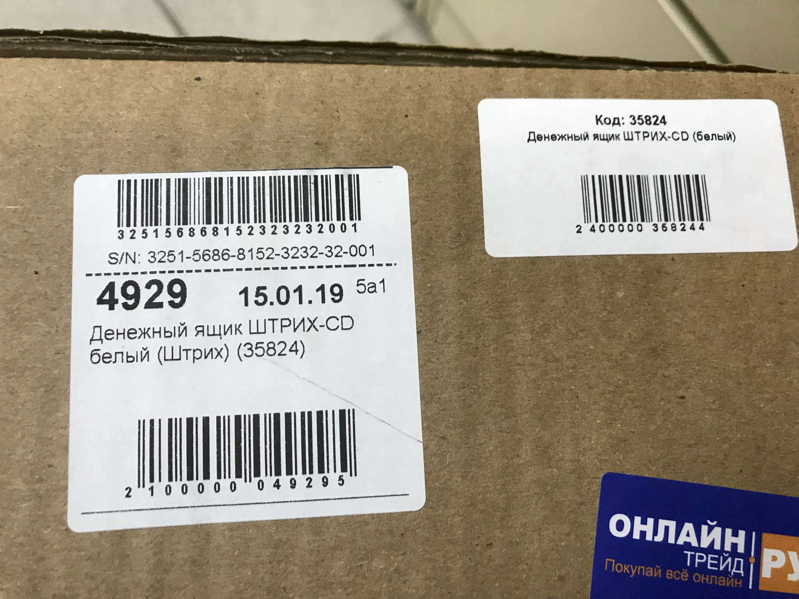
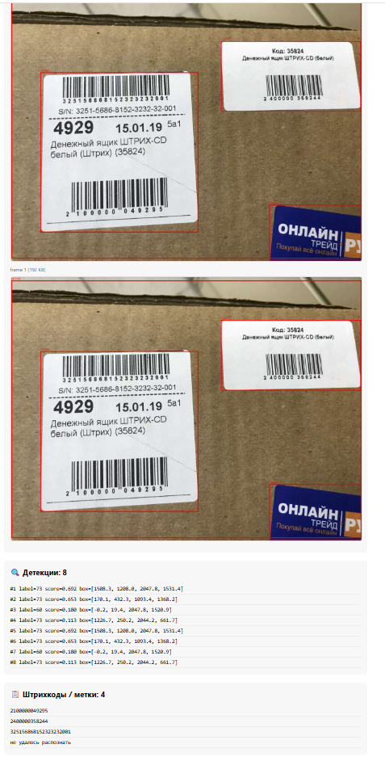

# Barcode Prototype

Прототип системы распознавания штрихкодов на фотографиях.
Пайплайн: загрузка фото → детекция объектов → распознавание штрихкодов → вывод результата на сайте.

## Архитектура

```
web  →  box.frames  →  inference-worker  →  frame.results  →  aggregator  →  box.results  →  web
```

| Сервис             | Роль                                                                          |
|--------------------|-------------------------------------------------------------------------------|
| `web`              | Принимает фото, отдаёт фронт, читает финальный результат из `box.results`     |
| `inference-worker` | RT-DETR v2 находит объекты на фото, zxingcpp распознаёт штрихкоды на кропах   |
| `aggregator`       | Собирает результаты по всем кадрам одного `box_id`, публикует финальный итог  |
| `kafka`            | Брокер сообщений, темы: `box.frames`, `frame.results`, `box.results`          |

## Как это работает

1. Пользователь загружает фото через веб-интерфейс.
2. `web` кодирует фото в base64 и отправляет в топик `box.frames`.
3. `inference-worker` читает кадр из `box.frames`:
   - декодирует изображение;
   - прогоняет через **RT-DETR v2** (`PekingU/rtdetr_v2_r50vd`) — получает список боксов;
   - для каждого бокса вырезает кроп и отправляет его в **zxingcpp**;
   - если штрихкод распознан — берёт его текст, иначе пишет «не удалось распознать»;
   - рисует рамки на фото и кодирует в base64;
   - отправляет в `frame.results`: `detections`, `barcodes`, `annotated_image_b64`.
4. `aggregator` собирает все кадры по `box_id` и публикует в `box.results`:
   - `barcodes` — список распознанных строк;
   - `detections` — список боксов;
   - `images` — список фото с рамками (base64).
5. `web` читает из `box.results`, кэширует результат и отдаёт его фронту по `GET /boxes/{box_id}/result`.
6. Фронт рисует фото с рамками и список распознанных штрихкодов внизу.

## Требования

- Docker и Docker Compose
- ~4 ГБ ОЗУ (RT-DETR v2 r50vd на CPU)
- Интернет при первой сборке (скачивание весов модели с Hugging Face)

## Запуск

```
docker compose build
docker compose up -d
```

Открыть: [http://localhost:8000](http://localhost:8000)

## API

| Метод | Путь                        | Описание                            |
|-------|-----------------------------|-------------------------------------|
| POST  | `/boxes/upload`             | Загрузка фото (multipart), возвращает `box_id` |
| GET   | `/boxes/{box_id}/result`    | Результат обработки по `box_id`     |

## Структура проекта

```
barcode-prototype/
├── docker-compose.yml
├── web/
│   ├── Dockerfile
│   ├── app/
│   │   └── main.py
│   └── static/
│       └── index.html
├── inference-worker/
│   ├── Dockerfile
│   ├── requirements.txt
│   └── main.py
├── aggregator/
│   ├── Dockerfile
│   ├── requirements.txt
│   └── main.py
└── README.md
```

## Пример

### Входное изображение

Файл: `image.jpg`



### Выходное изображение

Файл: `image.png` — фото с нарисованными рамками



### Распознанные штрихкоды

```
2100000049295
2400000358244
325156868152323232001
не удалось распознать
```

## Переменные окружения

### `inference-worker`

| Переменная          | По умолчанию                      | Описание                            |
|---------------------|-----------------------------------|-------------------------------------|
| `KAFKA_BOOTSTRAP`   | `localhost:9092`                  | Адрес Kafka                         |
| `MODEL_NAME`        | `PekingU/rtdetr_v2_r50vd`         | Модель RT-DETR v2                   |
| `CONF_THRESHOLD`    | `0.1`                             |                   |

### `aggregator`

| Переменная           | По умолчанию     | Описание                                 |
|----------------------|------------------|------------------------------------------|
| `KAFKA_BOOTSTRAP`    | `localhost:9092` | Адрес Kafka                              |


## Известные ограничения

- RT-DETR v2 обучен на **COCO** (80 классов: человек, машина, кошка и т.д.). Класса `barcode` там нет — модель находит **произвольные объекты**, а не сами штрихкоды. zxingcpp прогоняется по кропам этих объектов; если в кроп попал штрихкод — он распознаётся. Обучение не производилось.
- Всё общение через Kafka — сообщения с фото в base64. Для больших фото (>1 МБ после base64) может понадобиться увеличить `message.max.bytes` у брокера.
- `web` хранит результаты **в памяти** — при перезапуске контейнера они теряются.
- При первом запуске `inference-worker` скачивает веса модели (~300 МБ) с Hugging Face — это может занять несколько минут.

## Остановка

```
docker compose down
```

Полная очистка (включая Kafka-топики):

```
docker compose down -v
```